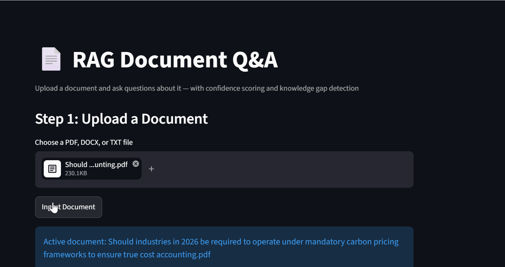
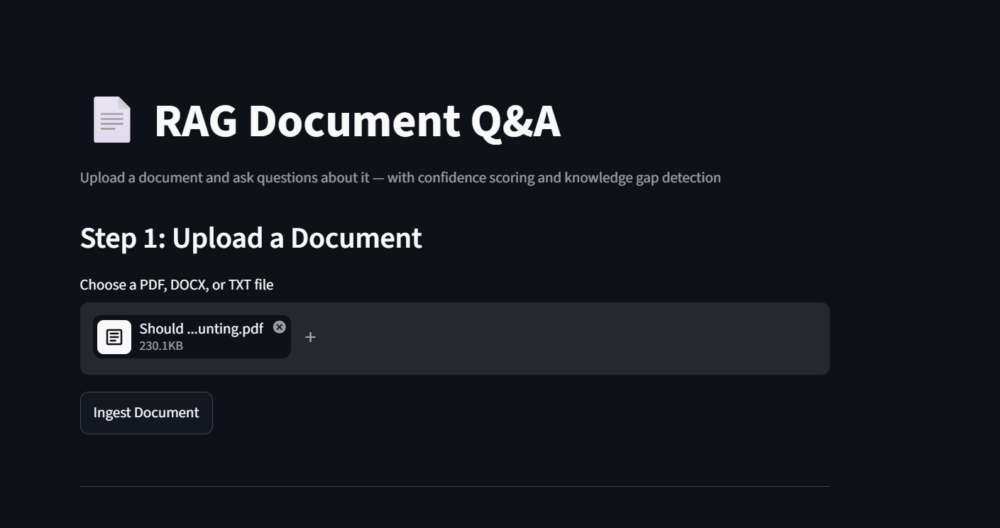

# RAG Document Q&A System
### with Confidence Scoring & Knowledge Gap Detection

Upload any PDF, DOCX, or TXT file and ask questions about it in plain English. Unlike standard RAG systems, this one tells you **how much to trust the answer** and explicitly flags when the document doesn't cover the topic — preventing hallucination at the source.

---

## Demo

**High confidence answer — document covers the topic:**



**Knowledge gap detection — document does not cover the topic:**



| Query | Confidence | Gap Flagged |
|-------|-----------|-------------|
| "How does the model identify migration pathways?" | HIGH (0.82) | No |
| "What is the graph structure used?" | MEDIUM (0.55) | No |
| "What is the recipe for chocolate cake?" | LOW (0.14) | Yes ⚠️ |

---

## Evaluation Results

Evaluated on 8 questions (5 in-domain, 3 out-of-domain) against a research paper on spatiotemporal graph convolutional networks.

| Metric | Score | Description |
|--------|-------|-------------|
| Context Precision | **0.80** | Retrieved chunks were relevant to the question |
| Faithfulness | **1.00** | All answers grounded in context — no hallucination indicators |
| Answer Relevancy | **0.41** | Keyword overlap with ground truth answers |
| Gap Detection Accuracy | **1.00** | All out-of-domain questions correctly flagged |

Faithfulness of 1.00 and Gap Detection of 1.00 mean the system never hallucinated and never missed an out-of-domain question in testing.

---

## Architecture

```
User uploads document
        │
        ▼
   ingest.py
   ├── Load PDF / DOCX / TXT
   ├── Chunk into 500-char segments (50-char overlap)
   ├── Embed with all-MiniLM-L6-v2 (384 dimensions)
   └── Store vectors + metadata in Qdrant

User asks a question
        │
        ▼
   retriever.py
   ├── Embed query with same model
   ├── Search Qdrant for top-4 similar chunks
   └── Pass scores to confidence.py
        │
        ▼
   confidence.py
   ├── score < 0.20  → Knowledge Gap flagged
   ├── score ≥ 0.55  → High confidence
   ├── score ≥ 0.35  → Medium confidence
   └── else          → Low confidence
        │
        ▼
   chain.py
   ├── Build prompt with retrieved context
   ├── Adjust instruction based on gap flag
   ├── Call Ollama (local LLM, zero cost)
   └── Return answer + confidence + sources
        │
        ▼
   api.py (FastAPI)  ←→  app.py (Streamlit UI)
```

---

## Tech Stack

| Layer | Tool | Why |
|-------|------|-----|
| Embedding | `all-MiniLM-L6-v2` (Sentence Transformers) | Free, fast, runs on CPU, 384 dimensions |
| Vector DB | Qdrant | Best open-source option, supports metadata filtering |
| LLM | Ollama + Mistral | Fully local, zero API cost |
| Chunking | LangChain `RecursiveCharacterTextSplitter` | Battle-tested, respects sentence boundaries |
| Backend | FastAPI | Async, auto-generates API docs at `/docs` |
| Frontend | Streamlit | Ships fast, looks professional |
| Evaluation | Custom metrics notebook | Context precision, faithfulness, gap detection |

100% free. No API keys. No cloud costs.

---

## Setup & Run

### Prerequisites
- Python 3.10+
- Docker Desktop
- [Ollama](https://ollama.com) with a model pulled: `ollama pull mistral`

### Option 1 — Docker (recommended)

```bash
git clone <your-repo-url>
cd rag-qa
docker compose up --build
```

Then open:
- Streamlit UI: http://localhost:8501
- API docs: http://localhost:8000/docs
- Qdrant dashboard: http://localhost:6333/dashboard

### Option 2 — Local development

```bash
pip install -r backend/requirements.txt
pip install -r frontend/requirements.txt

# Terminal 1 — Qdrant
docker run -p 6333:6333 qdrant/qdrant

# Terminal 2 — Backend
cd backend
python -m uvicorn api:app --reload --port 8000

# Terminal 3 — Frontend
cd frontend
python -m streamlit run app.py
```

---

## Project Structure

```
rag-qa/
├── backend/
│   ├── ingest.py        # Document loading, chunking, embedding, Qdrant storage
│   ├── confidence.py    # Confidence scoring + knowledge gap detection logic
│   ├── retriever.py     # Query embedding + Qdrant search + confidence assessment
│   ├── chain.py         # Prompt construction + Ollama LLM call
│   ├── api.py           # FastAPI routes (/upload, /ask)
│   └── Dockerfile
├── frontend/
│   ├── app.py           # Streamlit chat UI
│   └── Dockerfile
├── evaluation/
│   └── eval.ipynb       # Evaluation notebook with metric definitions
├── docker-compose.yml
├── requirements.txt
└── README.md
```

---

## Design Decisions

**Why chunk overlap of 50 characters?**
A key sentence often spans a chunk boundary. Without overlap, the context needed to answer a question can be split across two chunks and missed entirely. 50 characters (10% of chunk size) preserves boundary context without bloating storage.

**Why these confidence thresholds (0.20 / 0.35 / 0.55)?**
The default thresholds from the RAGAS literature (0.40 / 0.55 / 0.75) were too aggressive for `all-MiniLM-L6-v2`, which produces lower raw cosine similarity scores than larger models. These thresholds were calibrated empirically by running the evaluation dataset and checking that clearly relevant chunks scored above medium and clearly irrelevant ones triggered the gap flag.

**Why `all-MiniLM-L6-v2` over larger embedding models?**
It runs on CPU in under a second per chunk, requires no GPU, and produces 384-dimensional vectors that are fast to index and search. For a document Q&A use case where semantic similarity is more important than fine-grained nuance, it performs comparably to much larger models while being 10x faster.

**Why flag knowledge gaps before calling the LLM?**
The biggest failure mode in production RAG systems is confident hallucination — the model retrieves vaguely related text and generates a plausible-sounding but wrong answer. By checking retrieval quality first and adjusting the prompt instruction, we prevent the LLM from filling gaps with invented content.

---

## Interview Talking Points

- **What is RAG?** Retrieval Augmented Generation — instead of relying on the LLM's training data, you inject fresh document context at query time, grounding the answer in your specific files.
- **What makes this different from a basic RAG?** The confidence and gap detection layer. Most student projects just return an answer. This one scores the retrieval quality and flags when the document doesn't cover the topic, which is a real engineering concern in production systems.
- **How does confidence scoring work?** Qdrant returns a cosine similarity score (0–1) for each retrieved chunk. We take the weighted combination of the best score (70%) and average score (30%) and compare against calibrated thresholds.
- **What would you improve with more time?** Add a cross-encoder reranker to re-score retrieved chunks before generation, implement hybrid search (BM25 + semantic) for better exact-string matching, and let users tune the gap threshold per document type.
